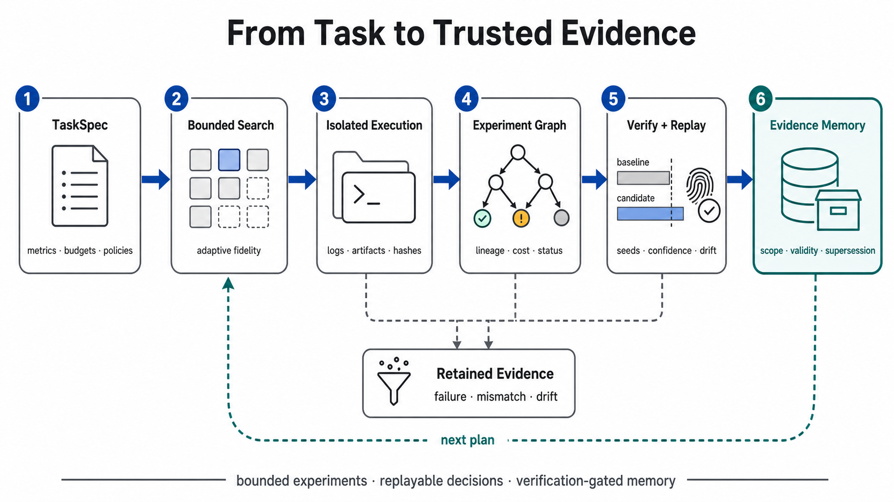
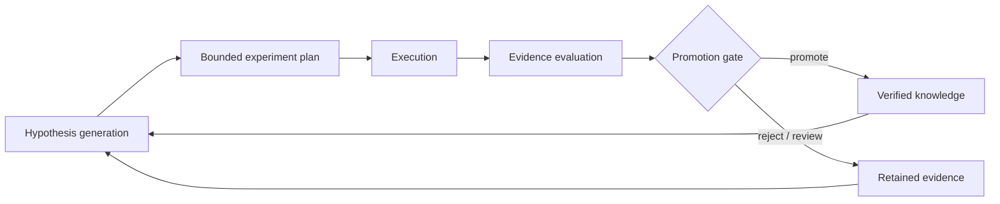
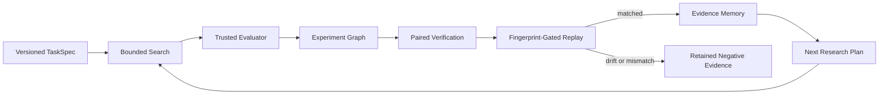

<div align="center">
  <h1>autoresearch-harness</h1>

  <p><strong>Turn an optimization idea into bounded experiments, replayable evidence, and a promotion decision.</strong></p>

  <p>
    <a href="https://github.com/Hubert-hwk/autoresearch-harness/actions/workflows/ci.yml"></a>
    
    <a href="LICENSE"></a>
    
    
  </p>

  

  <p>
    <a href="#quick-start">Quick Start</a> ·
    <a href="#results">Results</a> ·
    <a href="#how-it-works">Architecture</a> ·
    <a href="ROADMAP_V03.md">Roadmap</a> ·
    <a href="research/RESEARCH_DIRECTION_2026.md">Research</a> ·
    <a href="AGENT.md">Project Notes</a>
  </p>
</div>

---

`autoresearch-harness` is an empirical optimization engine for agent-driven
business and engineering research. It runs declared evaluators under explicit
budgets, isolates code changes, preserves the full experiment lineage, verifies
promising candidates across repeated seeds, replays the evidence, and only then
allows a result to become durable memory.

It is built for a different question than “can an agent generate an answer?”:
**can we inspect, reproduce, and trust the evidence behind a change?**

## Why this project

- **Execute real evaluators** — run trusted local commands without shell
  interpolation and retain metrics, logs, artifacts, timing, and hashes.
- **Keep experiments isolated** — apply typed patches inside detached Git
  worktrees without switching or rewriting the active checkout.
- **Preserve every decision** — model experiments as append-only,
  hash-chained nodes with lineage, budget, evaluation, and disposition.
- **Search within hard budgets** — use deterministic random sampling,
  Successive Halving, multi-fidelity promotion, and a Pareto archive.
- **Verify before promotion** — compare baseline and candidate over paired
  seeds with deterministic bootstrap intervals and independent guardrail gates.
- **Remember only replayed evidence** — admit durable claims only after a
  complete, drift-free verification and matched replay.

## Results

### MovieLens 100K — paired verification and replay

The versioned MovieLens protocol compares the same BPR configuration at 3 and
6 epochs over five held-out seeds. The candidate cleared the predeclared
NDCG@10 and guardrail gates, and an independent replay matched all 10 trials
with zero metric mismatches.

| Metric (mean over 5 paired seeds) | Baseline (3 epochs) | Candidate (6 epochs) | Change |
|---|---:|---:|---:|
| NDCG@10 | 0.033580 | 0.038026 | +0.004446 (+13.24%) |
| HitRate@10 | 0.062420 | 0.074098 | +0.011677 |
| Catalog coverage@10 | 0.135867 | 0.088321 | −0.047546 (−34.99%) |
| Mean training time | 3.327 s | 6.533 s | +96.37% |

The paired NDCG@10 improvement had a 95% bootstrap interval of
`[+0.001339, +0.008228]`, above the declared `+0.001` promotion threshold.
**Decision: `promote` under the declared gates; replay: `matched`.** Coverage
was measured but was not a promotion guardrail, so its regression and the
additional compute cost are explicit limitations—not hidden wins.

See the [versioned protocol, paired observations, and audit](benchmarks/movielens-100k/2026-08-19/README.md).

### Small BPR development audit

The repository's included BPR evaluator produced the following development
audit on the versioned toy interaction dataset. These numbers are deliberately
reported with the harness decision—not just the largest metric:

| Run | Best NDCG@10 | Search budget | Outcome |
|---|---:|---:|---|
| Baseline search | 0.187161 | 8 trials | reference |
| Focused candidate search | 0.218775 | 4 trials | `needs_review` |

The observed delta was `+0.031614`, but observed metric noise was `0.082306`.
The harness therefore did **not** promote the candidate; it requested more
seeds or a larger validation split. This is the intended evidence-first
behavior: an encouraging point estimate is not yet a trustworthy claim.

Run the same bounded workflow locally:

```bash
autoresearch research examples/recommender_bpr/task.json --agent rule
```

See the [audit methodology and limitations](docs/benchmarks/recommender-bpr-audit.md).

## Quick Start

The deterministic command-backed example needs no API key:

```bash
git clone https://github.com/Hubert-hwk/autoresearch-harness.git
cd autoresearch-harness
python3 -m venv .venv
source .venv/bin/activate
python -m pip install -e .
autoresearch run examples/external_command/task.json
```

Run the complete test suite:

```bash
python -m unittest discover -s tests
```

<details>
<summary><strong>Windows PowerShell</strong></summary>

```powershell
python -m venv .venv
.\.venv\Scripts\Activate.ps1
python -m pip install -e .
.\scripts\autoresearch.ps1 run examples\external_command\task.json
.\scripts\run-validation.ps1
```

</details>

## What you can run

| Capability | Command | Evidence produced |
|---|---|---|
| Bounded task evaluation | `autoresearch run TASK` | trials, analysis, decisions, report |
| Agentic research loop | `autoresearch research TASK` | hypothesis, mutation, effects, provenance |
| Isolated source patch | `autoresearch patch-run TASK PATCH` | worktree, diff, audits, hashes |
| Experiment graph audit | `autoresearch graph-status GRAPH_DIR` | validated graph snapshot |
| Multi-fidelity search | `autoresearch adaptive-run TASK` | promotions, budgets, Pareto archive |
| Independent verification | `autoresearch verify-run TASK BASELINE CANDIDATE` | paired interval, fingerprints, manifest |
| Scientific replay | `autoresearch replay VERIFICATION_DIR` | drift and metric-match report |
| Durable evidence memory | `autoresearch memory-ingest VERIFY_DIR REPLAY_RESULT` | typed claim and archived evidence bundle |

## LLM configuration

The default research agent is deterministic and requires no API key:

```bash
autoresearch research examples/recommender_bpr/task.json --agent rule
```

The optional `llm` agent currently supports OpenAI-compatible Chat Completions
endpoints. Configure it with:

```bash
export AUTORESEARCH_LLM_API_KEY="..."      # falls back to OPENAI_API_KEY
export AUTORESEARCH_LLM_MODEL="gpt-4.1-mini"
export AUTORESEARCH_LLM_BASE_URL="https://api.openai.com/v1"
autoresearch research examples/recommender_bpr/task.json --agent llm
```

Changing the base URL can connect another provider only when that provider is
wire-compatible with the endpoint used by the client. Native Anthropic API
support is not currently implemented. The LLM proposes a bounded hypothesis;
the same declared evaluator, budgets, evidence capture, and decision policy
remain in control of execution.



### Verify, replay, remember

```bash
autoresearch verify-run \
  examples/external_command/task.json \
  examples/external_command/baseline_params.json \
  examples/external_command/candidate_params.json \
  --repo-root .

autoresearch replay runs/verify_...

autoresearch memory-ingest \
  runs/verify_... \
  runs/replay_.../replay_result.json \
  --memory-dir memory

autoresearch memory-query \
  examples/external_command/task.json \
  --memory-dir memory \
  --repo-root .
```

## How it works



The durable path is intentionally narrower than the exploratory path:

```text
hypothesis → candidate → evaluation → verification → replay → evidence memory
                                      any failure ────────→ retained evidence
```

### Evidence contracts

| Contract | Purpose | Integrity boundary |
|---|---|---|
| `task.v2` | task, metrics, budgets, execution and mutation policy | strict schema validation |
| `patch.v1` | bounded UTF-8 source changes | allowlisted paths + pre/post audit |
| experiment events | immutable research lineage | sequence + SHA-256 hash chain |
| `scheduling.v1` | deterministic multi-fidelity allocation | global trial/time/fidelity budgets |
| `verification.v1` | repeated-seed promotion gate | paired interval + guardrail gates |
| `fingerprint.v1` | execution identity | task/data/code/runtime components |
| `replay.v1` | exact scientific reproduction | manifest hash + metric tolerance |
| `evidence-memory.v1` | reusable verified knowledge | replay admission + validity + supersession |

## Artifacts, not hidden state

Every run writes inspectable JSON, JSONL, Markdown, logs, and hashes under its
run directory. Depending on the command, this includes:

- resolved task and parameter snapshots;
- every successful, failed, timed-out, dominated, or rejected trial;
- stdout, stderr, metrics, declared artifacts, and SHA-256 digests;
- patch diffs, worktree identity, and filesystem audits;
- append-only experiment and memory event streams;
- paired statistics, execution fingerprints, and replay manifests;
- human-readable reports and machine-readable decisions.

Generated runs, datasets, memory, and local development logs are Git-ignored.

## Included evaluators

| Adapter | What it demonstrates | External dependency |
|---|---|---|
| `external_command` | real command execution and artifact capture | trusted local command |
| `recommender_bpr` | real multi-seed NumPy model training | NumPy |
| `ranking_param_tuning` | deterministic ranking optimization | none |
| `prompt_tuning` | bounded prompt-policy simulation | none |
| `model_param_tuning` | serving-parameter simulation | none |

The repository also includes a MovieLens 100K preparation and validation pack.
Raw benchmark data is downloaded outside version control.

## Why autoresearch-harness?

The project complements search libraries and tracking systems. It does not
claim that they cannot retain trials or artifacts; its distinction is that the
promotion and replay gates are first-class parts of one evidence contract.

| Capability | autoresearch-harness | Optuna | MLflow | General agent frameworks |
|---|:---:|:---:|:---:|:---:|
| Search and pruning | Built in | Built in | Not primary scope | Varies |
| Run and artifact tracking | Built in | Trial metadata | Built in | Varies |
| Hash-chained experiment lineage | Built in | Custom | Custom | Varies |
| Paired-seed promotion gate | Built in | Custom | Custom | Varies |
| Fingerprint-gated scientific replay | Built in | Custom | Custom | Varies |
| Validity-aware verified memory | Built in | Custom | Custom | Varies |

“Custom” means the capability can be assembled around that tool; it is not a
claim that the ecosystem lacks the underlying primitives.

## Safety model

The harness treats task files and evaluators as **trusted executable input**.
It prevents shell interpolation, constrains declared patches, preserves the
active worktree, checks evaluator side effects, enforces budgets, and detects
evidence drift. A detached Git worktree is source isolation—not an OS or
container security sandbox.

Do not run untrusted task definitions or evaluators without an external sandbox.

## Roadmap

The seven-phase v0.3 execution-core plan is complete:

- [x] Phase 0 — research baseline and architecture decision
- [x] Phase 1 — real command execution contract
- [x] Phase 2 — typed patch mutation and worktree isolation
- [x] Phase 3 — immutable experiment graph
- [x] Phase 4 — adaptive multi-fidelity scheduling
- [x] Phase 5 — verification, fingerprints, and replay
- [x] Phase 6 — validity-aware evidence memory

Next work is stabilization: multi-writer coordination, stronger sequential
statistics, signed provenance, OS-level isolation, and release discipline. See
[ROADMAP_V03.md](ROADMAP_V03.md) and the phase reviews under [reviews/](reviews/).

## Research basis

The architecture follows a primary-source review of automated empirical
research, software engineering agents, search and resource allocation,
verification benchmarks, and long-term agent memory. The synthesized direction
and paper index are available in:

- [Research direction](research/RESEARCH_DIRECTION_2026.md)
- [Literature index](research/literature/README.md)

Third-party paper PDFs are intentionally excluded from Git; the index links to
their original sources.

## Contributing

Issues and focused pull requests are welcome. A useful contribution should:

1. preserve the generic `TaskSpec → Trial → Result → Decision` protocol;
2. retain negative and failed evidence rather than silently dropping it;
3. add tests for new success and failure paths;
4. document the trust and reproducibility boundary it introduces.

Read [CONTRIBUTING.md](CONTRIBUTING.md) before opening a pull request. For
architecture context, start with [AGENT.md](AGENT.md). For implementation
sequencing, see [ROADMAP_V03.md](ROADMAP_V03.md). Please report vulnerabilities
according to [SECURITY.md](SECURITY.md).

## Citation

Citation metadata is available in [CITATION.cff](CITATION.cff). A minimal
software citation is:

```bibtex
@software{autoresearch_harness_2026,
  author = {He, WenKang},
  title = {autoresearch-harness},
  year = {2026},
  url = {https://github.com/Hubert-hwk/autoresearch-harness}
}
```

## License

Licensed under the [Apache License 2.0](LICENSE), which permits commercial use
and includes an explicit patent grant. See the license text for its conditions.

---

<div align="center">
  <strong>Auditable experiments over unverifiable automation.</strong><br />
  <sub>If this direction is useful, consider starring the repository or opening a focused issue.</sub>
</div>
